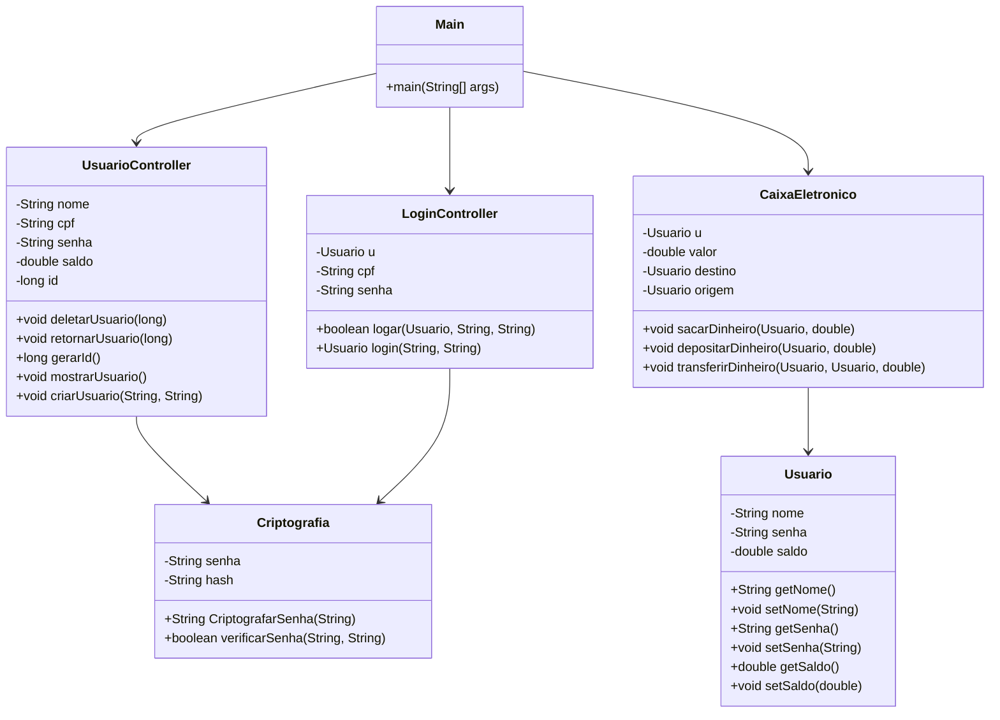

# Caixa Eletrônico

[](https://www.java.com)
[](https://maven.apache.org/)
[](https://github.com/jeremyh/jBCrypt)

## Visão Geral

O projeto Caixa Eletrônico é uma simulação de um sistema de caixa eletrônico (ATM) via linha de comando (CLI). Ele permite que os usuários criem contas, façam login, verifiquem o saldo, depositem, saquem e transfiram dinheiro. A segurança das senhas é garantida por meio da biblioteca jBCrypt para hashing.

## Arquitetura e Design de Software

O projeto é estruturado em pacotes que separam as responsabilidades, seguindo uma adaptação do padrão Model-View-Controller (MVC) para uma aplicação de console.

### Estrutura de Pacotes

| Pacote | Responsabilidade |
| :--- | :--- |
| `br.com.CaixaEletronico.Entity` | Contém as classes de entidade (POJOs), como `Usuario`, que representam os dados do sistema. |
| `br.com.CaixaEletronico.Controller` | Contém as classes que orquestram a lógica de negócio, como `CaixaEletronico`, `LoginController` e `UsuarioController`. |
| `br.com.CaixaEletronico.Criptografia` | Contém a classe `Criptografia`, responsável por lidar com o hashing e a verificação de senhas usando jBCrypt. |
| `br.com.CaixaEletronico` | Pacote raiz que contém a classe `Main`, o ponto de entrada da aplicação. |

### Diagrama de Classes (Mermaid)



## Funcionalidades Principais

*   **Criação de Conta:** Permite que novos usuários se cadastrem com nome e senha.
*   **Login Seguro:** Autenticação de usuários com senhas criptografadas (hashed com jBCrypt).
*   **Operações Bancárias:**
    *   **Saque:** Retirada de dinheiro da conta.
    *   **Depósito:** Adição de dinheiro à conta.
    *   **Transferência:** Envio de dinheiro para outra conta.
    *   **Consulta de Saldo:** Verificação do saldo atual.

## Tecnologias e Dependências

*   **Java 17+:** Linguagem de programação principal.
*   **Maven:** Ferramenta de automação de compilação e gerenciamento de dependências.
*   **jBCrypt:** Biblioteca para hashing de senhas.

## Instalação e Execução

1.  **Pré-requisitos:**
    *   Java 17 ou superior instalado.
    *   Maven instalado.

2.  **Clone o repositório:**

    ```bash
    git clone https://github.com/GilvanPedro/CaixaEletronico.git
    ```

3.  **Navegue até o diretório do projeto:**

    ```bash
    cd CaixaEletronico/CaixaEletronico
    ```

4.  **Compile e execute o projeto com Maven:**

    ```bash
    mvn compile exec:java -Dexec.mainClass="br.com.CaixaEletronico.Main"
    ```

## Exemplo de Interação (CLI)

```
====== CAIXA ELETRÔNICO ======
1 - Criar conta
2 - Login
0 - Sair
Escolha: 1

Nome: Gilvan
Senha: 123
Usuário criado com sucesso!

====== CAIXA ELETRÔNICO ======
1 - Criar conta
2 - Login
0 - Sair
Escolha: 2

Nome: Gilvan
Senha: 123
Login bem-sucedido!

====== BEM-VINDO, Gilvan! ======
1 - Sacar
2 - Depositar
3 - Transferir
4 - Ver Saldo
0 - Logout
Escolha: 4

Saldo: R$ 0.0
```
